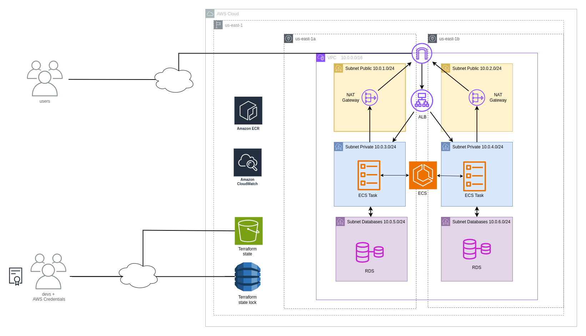

# CI/CD 

This is a project that seeks to provide a continuos integration and deployment solution for a full-stack web application, as well as a AWS architecture defined in terraform


## LendARead's Goal


The goal of the web application is to create a community of readers, where all of them can upload their books and request loans from each other. The aim is to allow readers to access books that would not normally be easily accessible.

For example, let's imagine the user Marco, who enjoys reading philosophy in multiple languages. Thanks to other readers with German heritage (for example), he can borrow a philosophy book from a German author that he could not have read by going to a library in Argentina.


## Architecture

The LendARead architecture is deployed through terraform as part of a 3-tier architecture. In addition, the current project builds three versions: dev, qa, prod thus providing a devops approach to the deployment of LendARead.



The diagram shows the three different versions of the same architecture design. Due to time constraints the actual deployments of dev and qa do not fully optimize deployments as per the diagram (it's more like two more prod enviroments
but without database and task replication).
## CI/CD Setup

To begin the pipeline one should first initialize the s3 bucket and dynamo table to hold both the terraform state as well as a lock to prevent incosistencies in the terraform state stored in the s3. To initialize the architecture one should push the tag `init`

```bash
git tag init                                                                                          
git push origin init
```

This will trigger a Github action that will create the s3 bucket and dynamo table. After this is complete one can push to the main branch, this will run the `terraform init` and `terraform apply` using the state defined in the last step. Whatever changes are done to the application, or the infraestructure itself, will be updated in the deployment. The key here is that because the state is stored in a s3 only the changes to the current architecture will be made, if nothing of the infraestructure changed then only the docker image will be updated. 

## CI/CD Requirements

Create a pipeline that includes the following elements:

- Have a code repository in Git that, every time a push occurs, builds the code and deploys it in a container (on-premise with Docker, deploying it in Kubernetes on-premise or using EKS or ECS on AWS), on a virtual machine, or in a serverless execution service (for example, Lambda).
- Prior to deployment, execute the unit tests of the code.
- Send a notification to the DevOps team if the deployment was successful. If it was unsuccessful, send a notification, stop the deployment, and perform a rollback.
- Before deployment in the environment, create a manual approval process for a select group of people.
- Show how to make a deployment in the same pipeline but multi-environment. For example, first deploy the code in development and then in production.
- Optional: Explain and show which components could be used to deploy a web page or mobile app and perform a UX/UI test.

CI/CD Secrets:
- `AWS_ACCESS_KEY_ID`: Key ID for accessing the AWS account
- `AWS_REGION`: Region where the application is deployed
- `AWS_SECRET_ACCESS_KEY`: Value for accessing the AWS account
- `AWS_SESSION_TOKEN`: AWS session token
- `DYNAMODB_TERRAFORM_LOCK_NAME`: Lock to prevent race conditions on the Terraform state stored in the S3 bucket
- `ECR_URL`: ECR URL once deployed
- `S3_TERRAFORM_STATE_NAME`: Bucket for storing the Terraform state
- `SLACK_WEBHOOK_URL`: Slack webhook for notifications
- `SMTP_SERVER`: SMTP server URL
- `SMTP_USERNAME`: Username for the SMTP server
- `SMTP_PASSWORD`: Password for the SMTP server
- `SMTP_PORT`: Port for the SMTP server
